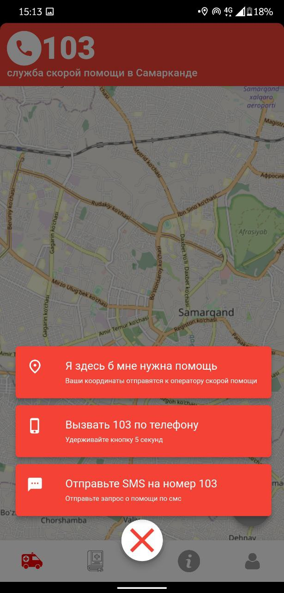
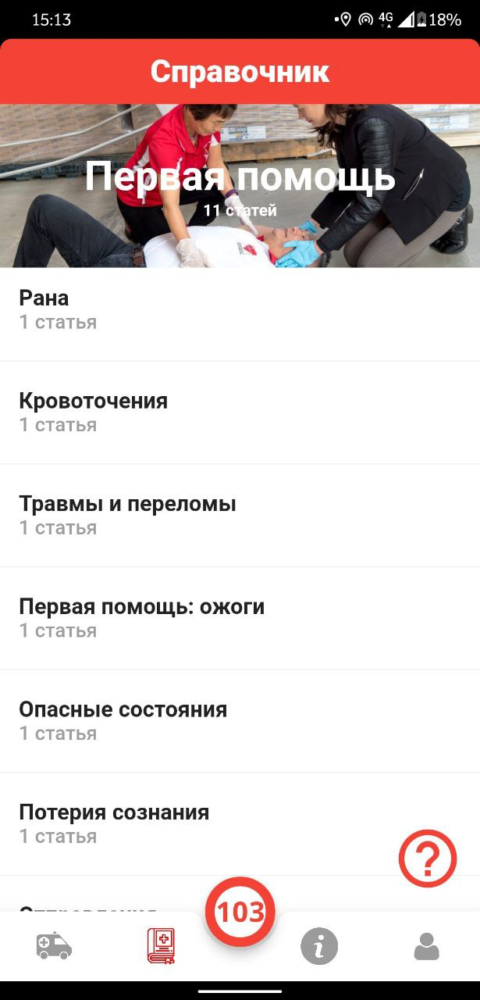
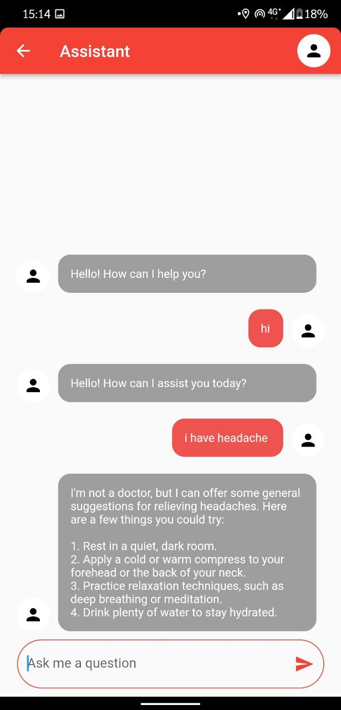

# health_care

A new Flutter project.

## Description

This is a health care app that helps you to keep track of your health and also helps you to find the nearest hospital in case of emergency. It also has a feature to call the ambulance in case of emergency. It shows where you are in the map to the ambulance driver so that he can reach you as soon as possible.
And you can also chat with the doctor AI to get some basic information about your health.

## Screenshots

## Getting Started

This project is a starting point for a Flutter application.

A few resources to get you started if this is your first Flutter project:

- [Lab: Write your first Flutter app](https://docs.flutter.dev/get-started/codelab)
- [Cookbook: Useful Flutter samples](https://docs.flutter.dev/cookbook)

For help getting started with Flutter development, view the
[online documentation](https://docs.flutter.dev/), which offers tutorials,
samples, guidance on mobile development, and a full API reference.
